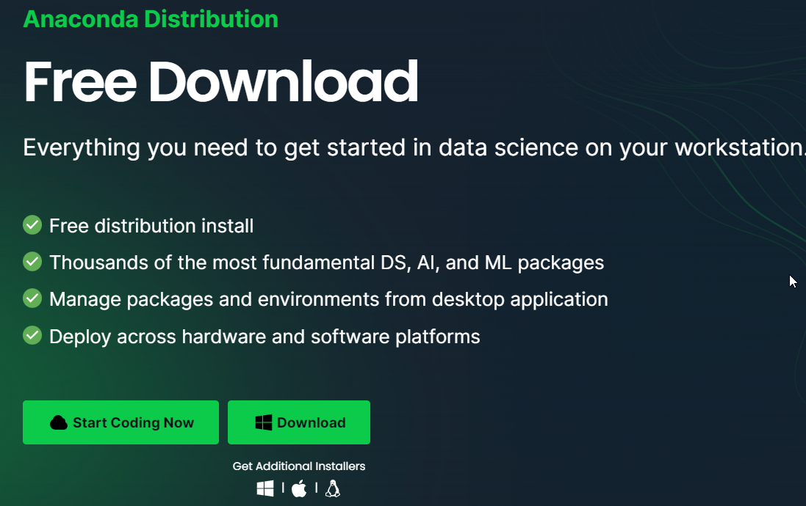

# Introduction to DataScience Programming

## Computer Preparation
In order to start our Data science programming. 
We can provide our computer to get run
- [ ] Install Python run time, and Data science package

    The one of the easiest way is to install Conda,
    install the Conda from the given link [here](https://www.anaconda.com/download).

- [ ] To follow the code conduct in the course, 
please sign up the [GitHub](https://github.com/) to get the code repository  and other benefit. 
using your @cmu.ac.th email
- [ ] please register your email after you have register GitHub [here](https://forms.gle/P7MBZVDhZcS6aC1QA)
- [ ] After you have signed in for the GitHub, please register to [GitHub Student Developer Pack](https://education.github.com/pack) 
to get the benefit of the students.
- [ ] The tools which we are going to use is PyCharm which is the IDE tools for Pythons. We can use the Professional Edition as we are students.
Login to the [ get the student account](https://www.jetbrains.com/lp/leaflets-gdc/students/) for PyCharms
- [ ] Download [Pycharm](https://www.jetbrains.com/pycharm/) to your own computer. Then install, once you start the Pycharm, please 
log in with the email account you have installed from the previous steps
## Using Git
The course material is provided in the Git Repository. You should fork the project in order that
you can manage your work and still getting the new resources. Please follow the giving steps
to prepare your work space.
- [ ]
    
